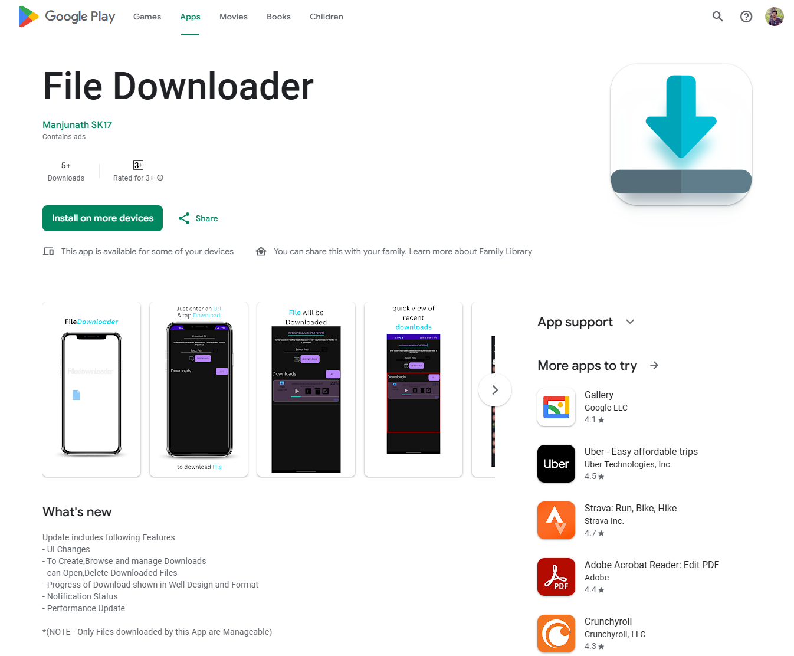
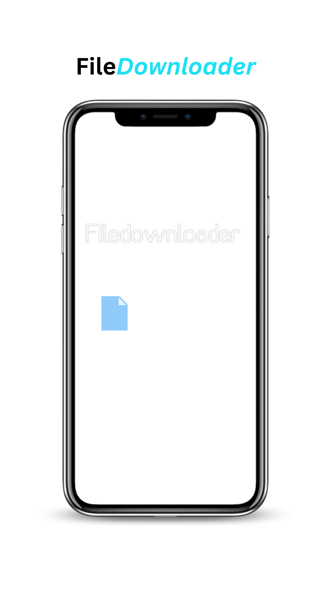
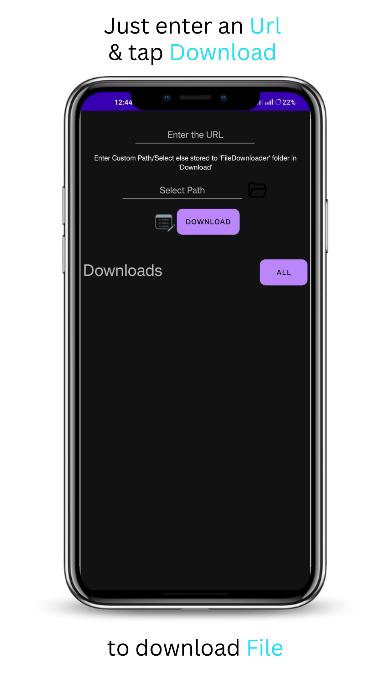
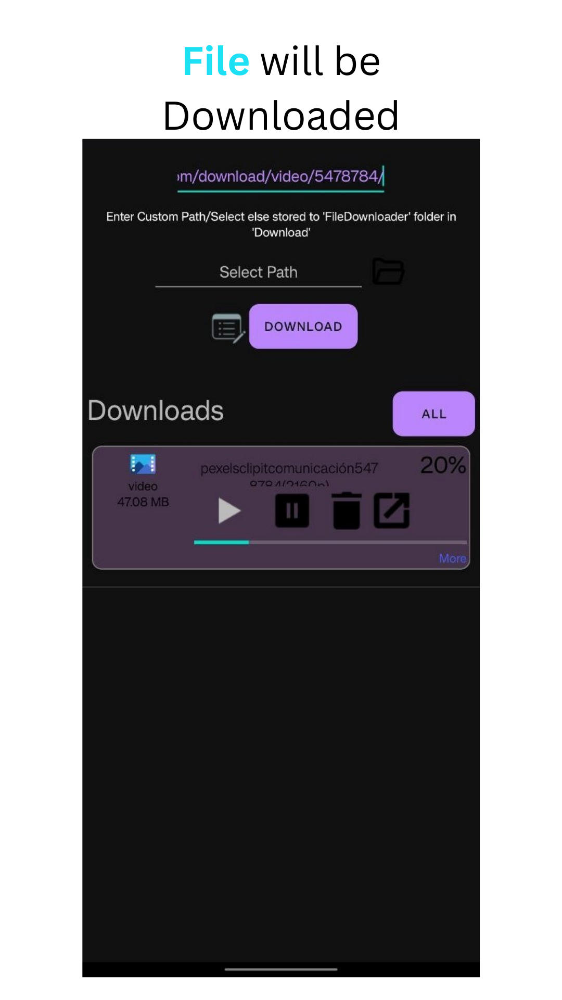
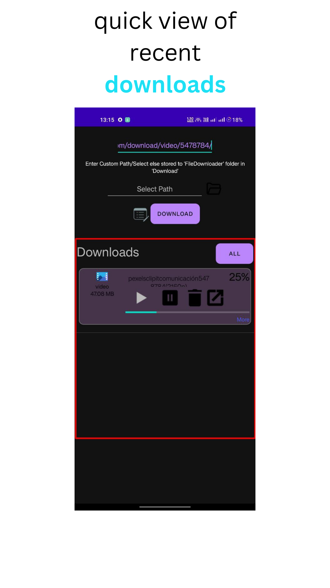
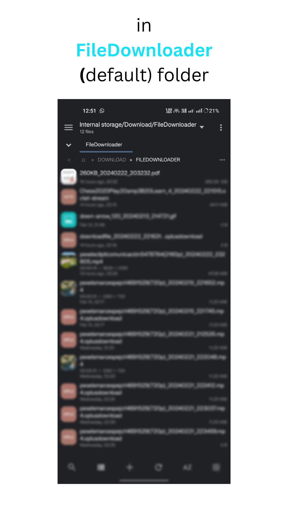
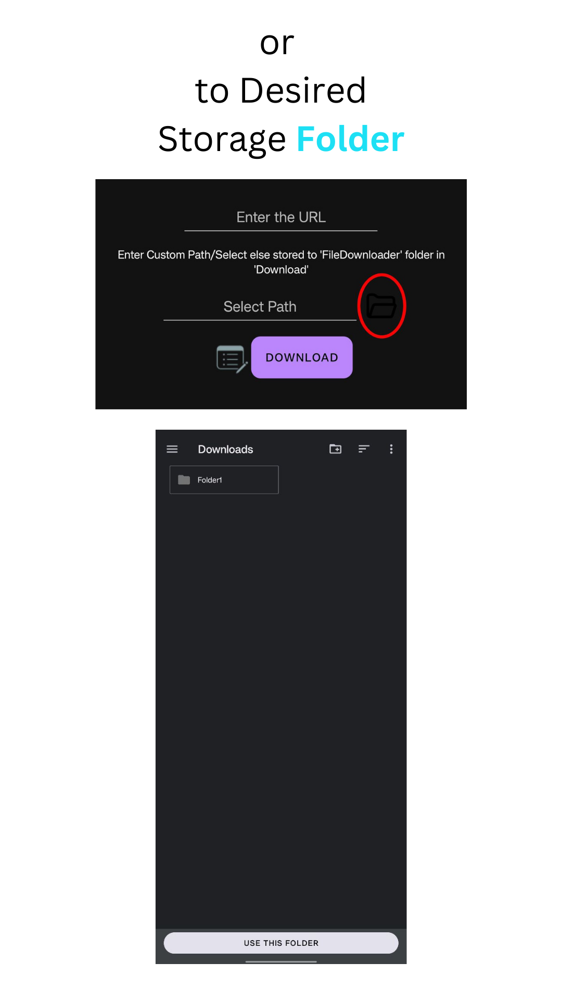
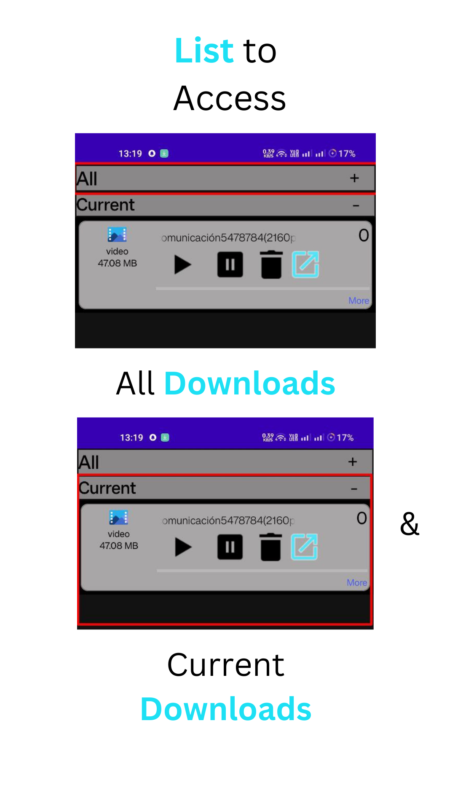
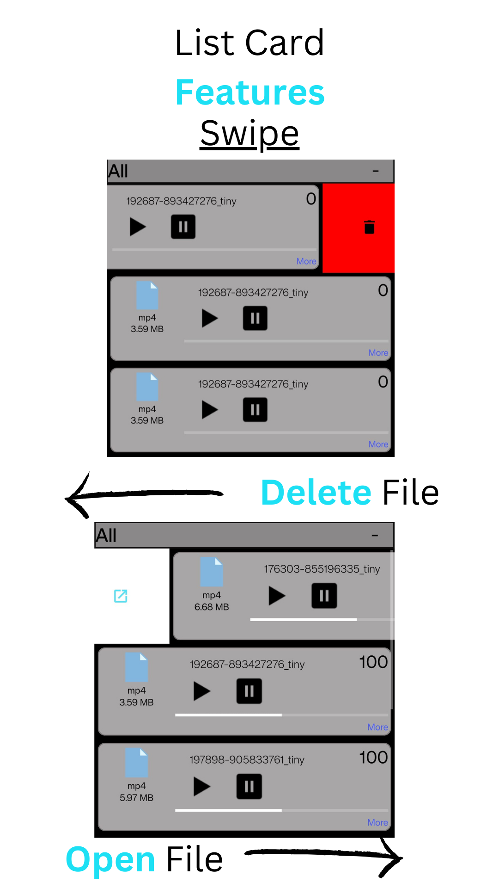

# Filedownloader

  
    <h3>
 For Specific version of this App goto 
</h3>
    "<a href="https://github.com/SK1793/Filedownloader-Versions/tree/main">FilesDownloader-Verions</a>" Repo
  

This is an Android App For dowloading fles via  "URL".
(Below Are some ScreenShots Of the App)

  

      

      
    
  
    

      
      
    
    
    

      
      
    
    
    

      
      
    

    

      
      
    

  

